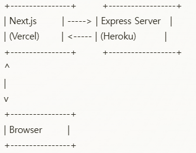

# 📚 재이서점 (RGT Bookstore)

[](LICENSE)

> **온라인 서점**으로, 책 목록 조회, 판매 통계, 책 등록, 책 삭제 등의 기능을 제공합니다.  
> 프론트엔드는 Next.js (TypeScript), 백엔드는 Node.js(Express)로 구현하였으며
> Heroku와 Vercel을 사용해 배포했습니다.

<p align="center">
  
</p>

---

## 📖 목차
1. [프로젝트 개요](#프로젝트-개요)  
2. [주요 기능](#주요-기능)  
3. [기술 스택](#기술-스택)  
4. [시스템 아키텍처](#시스템-아키텍처)  
5. [설치 방법 (로컬)](#설치-방법-로컬)  
6. [배포 (Heroku & Vercel)](#배포-heroku--vercel)  
7. [실행 방법](#실행-방법)  
8. [코드 상세](#코드-상세)  
   - [백엔드 구조](#백엔드-구조)  
   - [프론트엔드 구조](#프론트엔드-구조)  
9. [시연 영상/스크린샷](#시연-영상스크린샷)  
10. [개발 환경](#개발-환경)  
11. [폴더 구조](#폴더-구조)  

---

## 프로젝트 개요
**재이서점**은 간단한 온라인 서점 애플리케이션입니다.  
- 책 목록 조회, 검색/필터, 판매 통계, 책 등록/삭제, 책 상세 보기 기능을 제공합니다.  
- **프론트엔드**는 Next.js + TypeScript로 개발, **백엔드**는 Express + TypeScript로 개발했습니다.  
- **Heroku**(백엔드)와 **Vercel**(프론트엔드)에 배포되어, 누구나 접속 가능합니다.

### 배포 주소
- **프론트엔드 (Vercel)**: [https://rgt-assignment-orcin.vercel.app/](https://rgt-assignment-orcin.vercel.app/)  
- **백엔드 (Heroku)**: [https://my-backend-app-rgtbookstore-dc3bf12d7286.herokuapp.com/api/books](https://my-backend-app-rgtbookstore-dc3bf12d7286.herokuapp.com/api/books)  
- **GitHub Repo**: [https://github.com/Kim-Jaei/rgt--assignment](https://github.com/Kim-Jaei/rgt--assignment)

---

## 주요 기능
1. **책 목록 조회**  
   - 제목/저자 검색, 가격대 필터, 정렬(제목/저자/가격/판매량)  
   - 페이지네이션(한 페이지당 10개)

2. **책 상세 보기**  
   - 책의 가격, 저자, 판매량 확인  
   - 책 삭제 기능

3. **책 등록**  
   - 새 책 제목, 저자, 가격, 판매량 입력 가능

4. **판매 통계**  
   - 총 판매 수량, 총 매출액, 등록된 책 수, 책당 평균 판매량  
   - 베스트셀러 Top 5(Bar Chart), 가격대별 판매 분포(Pie Chart)

5. **검색/필터 초기화**  
   - 헤더의 "재이서점" 혹은 "홈" 클릭 시 전체 필터/검색 리셋

---

## 기술 스택

### 📱 프론트엔드
- **Next.js** (TypeScript)
- **React** (Hooks, Functional Components)
- **Recharts** (데이터 시각화)
- **Vercel** (배포)

### 🌐 백엔드
- **Node.js** + **Express** (TypeScript)
- **Heroku** (배포)
- **axios** (프론트-백엔드 통신)
- **RESTful API**

### 🛠 공통
- **Git / GitHub** (소스 관리)
- **npm** (패키지 관리)
- **ESLint / Prettier** (코드 품질)

---

## 시스템 아키텍처


프론트엔드(Vercel): 정적 파일 + SSR(Next.js)  
백엔드(Heroku): Node.js/Express 서버  
Browser에서 Vercel로 접속 → Vercel이 Heroku API 호출 → JSON 데이터 반환

---

## 설치 방법 (로컬)
테스트 환경: Ubuntu 18.04

1. 저장소 클론
```bash
git clone https://github.com/Kim-Jaei/rgt--assignment.git
cd rgt--assignment
```

2. 프론트엔드 설치
```bash
cd frontend
npm install
```

.env.local(옵션):
```bash
NEXT_PUBLIC_API_URL=http://localhost:4000/api
```
로컬에서 백엔드를 띄운 뒤 프론트엔드가 이 주소를 호출

3. 백엔드 설치
```bash
cd ../backend
npm install
```

.env(옵션):
```ini
PORT=4000
```

---

## 실행 방법

### 4. 빌드 & 실행
#### 백엔드

```bash
cd backend
npm run build
npm start
```
→ http://localhost:4000 에서 서버 실행

#### 프론트엔드

```bash
cd frontend
npm run dev
```
→ http://localhost:3000 에서 프론트 실행

---

## 배포 (Heroku & Vercel)

### 1. Heroku 배포 (백엔드)
- Heroku CLI 설치 후 로그인
- Heroku 앱 생성
```bash
heroku create my-backend-app-rgtbookstore
```
- Procfile 확인
```bash
# Procfile
web: node dist/index.js
```
- 배포
```bash
cd backend
git init
git add .
git commit -m "Deploy backend"
heroku git:remote -a my-backend-app-rgtbookstore
git push heroku master
```
- 로그 확인
```bash
heroku logs --tail
```

### 2. Vercel 배포 (프론트엔드)
- Vercel 계정 생성 및 GitHub 연동
- New Project → GitHub Repo 선택 → Build 설정 자동 감지
- 환경 변수 설정
  - `NEXT_PUBLIC_API_URL=https://my-backend-app-rgtbookstore.herokuapp.com/api`
- Deploy 버튼 클릭
- 배포 완료 후 Vercel 도메인 확인

---

## 실행 방법
### 로컬
- 백엔드: npm run build && npm start (포트 4000)
- 프론트엔드: npm run dev (포트 3000)
- 브라우저에서 http://localhost:3000 접속

### 배포
- 프론트: https://rgt-assignment-orcin.vercel.app/
- 백엔드: https://my-backend-app-rgtbookstore-dc3bf12d7286.herokuapp.com/api/books

---

## 코드 상세
### 백엔드 구조
```
backend/
 ┣ src/
 ┃ ┣ controllers/
 ┃ ┃ ┗ booksController.ts
 ┃ ┣ routes/
 ┃ ┃ ┗ bookRoutes.ts
 ┃ ┣ index.ts
 ┃ ┗ ...
 ┗ package.json
```

#### 1) index.ts
```typescript
import express from 'express';
import cors from 'cors';
import bookRoutes from './routes/bookRoutes';

const app = express();
app.use(cors());
app.use(express.json());

app.use('/api/books', bookRoutes);

app.get('/', (req, res) => {
  res.send('Hello from backend!');
});

const PORT = process.env.PORT || 4000;
app.listen(PORT, () => {
  console.log(`Backend running on port ${PORT}`);
});
```
- Express 초기 설정
- cors()로 CORS 허용
- express.json()으로 JSON 본문 파싱
- 라우트 연결: /api/books → bookRoutes
- Heroku 포트 환경 변수(PORT) 사용

#### 2) bookRoutes.ts
```typescript
import { Router } from 'express';
import {
  getBooks,
  getBookById,
  createBook,
  updateBook,
  deleteBook,
  getSalesStats,
} from '../controllers/booksController';

const router = Router();

router.get('/', getBooks);
router.get('/sales', getSalesStats);
router.get('/:id', getBookById);
router.post('/', createBook);
router.put('/:id', updateBook);
router.delete('/:id', deleteBook);

export default router;
```
- RESTful 라우팅
- GET /api/books : 책 목록 조회
- GET /api/books/sales : 판매 통계
- POST /api/books : 새 책 등록
- DELETE /api/books/:id : 책 삭제
- 각각의 요청이 booksController의 메서드로 연결됨

#### 3) booksController.ts
```typescript
import { Request, Response } from 'express';

let books = [ /* 초기 책 데이터 53개 */ ];

export const getBooks = (req: Request, res: Response) => {
  // 검색, 가격대 필터, 정렬, 페이지네이션 로직
  // 응답: { total, books: [...10개 책...] }
};

export const getBookById = (req: Request, res: Response) => {
  // 특정 ID의 책 찾기
};

export const createBook = (req: Request, res: Response) => {
  // 새 책 생성
};

export const updateBook = (req: Request, res: Response) => {
  // 책 수정
};

export const deleteBook = (req: Request, res: Response) => {
  // 책 삭제
};

export const getSalesStats = (req: Request, res: Response) => {
  // 판매 통계: 총판매량, 총매출, 베스트셀러, 가격대별 판매 분포
};
```
- books 배열: DB 없이 하드코딩된 책 목록
- getBooks
  - req.query로 search, minPrice, maxPrice, sortBy, order, page, limit 받음
  - 필터, 정렬, 슬라이스 → res.json({ total, books: ... })
- deleteBook
  - req.params.id를 숫자로 변환 후 books.splice
- getSalesStats
  - reduce()로 총판매량, 총매출 계산
  - sort()로 베스트셀러, priceRanges 계산

---

### 프론트엔드 구조
```
frontend/
 ┣ pages/
 ┃ ┣ index.tsx          # 메인 페이지 (책 목록)
 ┃ ┣ books/
 ┃ ┃ ┣ [id].tsx         # 책 상세
 ┃ ┃ ┗ new.tsx          # 새 책 등록
 ┃ ┣ stats.tsx          # 판매 통계
 ┃ ┗ _app.tsx
 ┣ components/
 ┃ ┣ Layout.tsx         # 공통 레이아웃 (헤더/푸터)
 ┃ ┗ BookCard.tsx       # 책 목록 카드
 ┣ services/
 ┃ ┗ api.ts             # axios 설정
 ┣ types/
 ┃ ┗ Book.ts            # Book 타입 정의
 ┗ styles/globals.css
```

#### 1) index.tsx (메인 페이지)
```typescript
export default function Home() {
  // 책 목록(books), 검색/필터/페이지네이션 상태, error, loading 등
  // fetchBooks()로 백엔드 호출
  // BookCard 컴포넌트로 목록 표시
}
```
- 검색/필터/페이지네이션
- URLSearchParams로 쿼리 생성 → api.get(...)
- 응답이 { total, books }이면 setBooks(books), setTotalPages(...)
- 렌더링: .book-grid CSS로 예쁘게 표시, BookCard에 props로 전달

#### 2) BookCard.tsx
```typescript
const BookCard: React.FC<{ book: Book }> = ({ book }) => {
  // 마우스 hover 시 scale(1.05)
  // 표지 색상: HSL((id * 20) % 360, ...)
  // title substring(0,1) 표시
};
```
- 책의 첫 글자만 표지로 크게 표시
- 클릭 시 /books/[id] 상세 페이지로 이동

#### 3) new.tsx (새 책 등록)
```typescript
export default function NewBookPage() {
  // title, author, price, sales
  // api.post('/books', { ... })
}
```
- 성공 시 "등록 성공" 메시지 표시
- "등록 중…" 로딩 상태

#### 4) [id].tsx (책 상세 페이지)
```typescript
export default function BookDetailPage() {
  // router.query.id
  // api.get(`/books/${id}`)
  // handleDelete() -> api.delete(`/books/${id}`)
}
```
- handleDelete 클릭 시 confirm → 삭제 후 홈으로 이동

#### 5) stats.tsx (판매 통계)
```typescript
export default function Stats() {
  // api.get('/books/sales')
  // totalSales, totalRevenue, etc.
  // BarChart, PieChart (recharts)
}
```
- ResponsiveContainer + chart → 반응형 차트
- "가격대별 판매 분포" PieChart

#### 6) Layout.tsx
```typescript
const Layout: React.FC<LayoutProps> = ({ children, title = '재이서점' }) => {
  // 공통 헤더/푸터
  // 헤더: 재이서점 로고, 홈/판매 통계/책 등록 메뉴
  // 메인: children
  // 푸터: © 재이서점
};
```
- 헤더 "재이서점" 클릭 시 window.location.reload() → 필터/검색 초기화
- CSS: globals.css에서 .layout, .header, .footer 등

#### 7) api.ts
```typescript
import axios from 'axios';

const API_URL = process.env.NEXT_PUBLIC_API_URL || 'http://localhost:4000/api';

const api = axios.create({
  baseURL: API_URL,
  headers: { 'Content-Type': 'application/json' },
});

export default {
  get: (url: string) => api.get(url),
  post: (url: string, data: any) => api.post(url, data),
  put: (url: string, data: any) => api.put(url, data),
  delete: (url: string) => api.delete(url),
};
```
- NEXT_PUBLIC_API_URL: Vercel 환경 변수로 Heroku 백엔드 주소
- fallback: localhost:4000/api

---

## 시연 영상
<video src="./rgt--assignment.mkv" controls="controls" style="max-width: 700px;">
</video>

- 메인: 책 목록 - 검색/필터/정렬 & 페이지네이션
- 판매 통계: 판매 수량, 총 매출액, 등록된 책, 책당 평균 판매량, 베스트셀러 Top 5, 가격대별 판매 분호
- 책 등록: 새로운 도서 등록

---

## 개발 환경
- OS: Ubuntu 18.04 LTS
- Node.js: v16.x
- npm: v8.x
- IDE: VSCode
- Browser: Chrome, Firefox

---

## 폴더 구조
```
rgt--assignment/
 ┣ frontend/      # Next.js 프로젝트
 ┃ ┣ pages/       # 페이지 라우팅
 ┃ ┣ components/  # Layout, BookCard 등
 ┃ ┣ services/    # api.ts (axios 설정)
 ┃ ┣ ...
 ┣ backend/       # Node.js + Express 서버
 ┃ ┣ src/
 ┃ ┃ ┣ controllers/
 ┃ ┃ ┣ routes/
 ┃ ┃ ┗ index.ts
 ┃ ┣ dist/
 ┃ ┣ package.json
 ┗ README.md      # 본 문서
```
